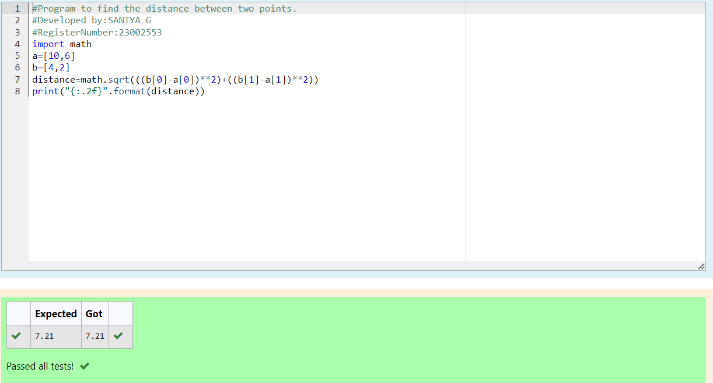

# DISTANCE-BETWEEN-TWO-POINTS

## AIM:
To write a python program to find the distance two 2 points
## ALGORITHM:
### Step 1: 
Start the program
### Step 2: 
Assign values for the variables x2,x1,y2,y1
### Step 3: 
Substitute the values in the distance formula  
### Step 4: 
Print the distance using format to display the answer with two decimal points
### Step 5: 
End the program
### PROGRAM:
``````
#Program to find the distance between two points.
#Developed by:SANIYA G
#RegisterNumber:23002553
import math
a=[10,6]
b=[4,2]
distance=math.sqrt(((b[0]-a[0])**2)+((b[1]-a[1])**2))
print("{:.2f}".format(distance))
``````
### OUTPUT:

### RESULT:
Thus the distance between two variables are executed successfully
